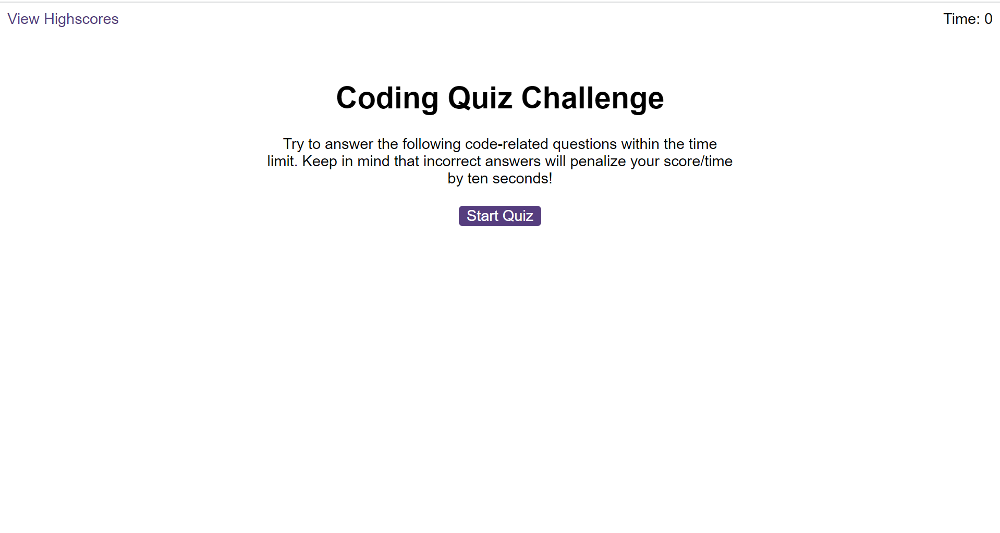
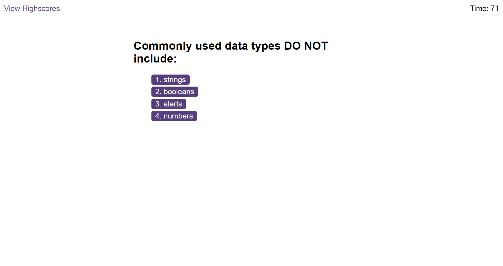
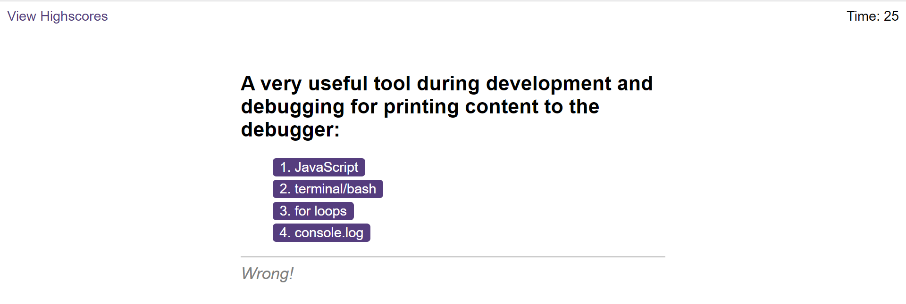
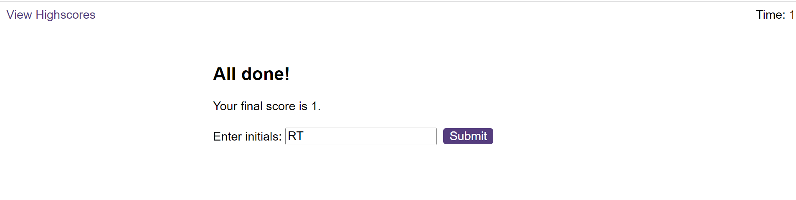
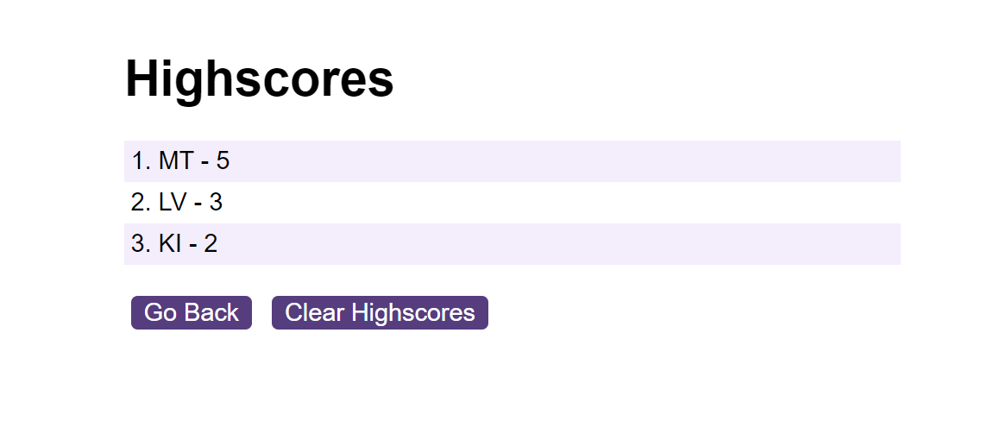

# Code Quiz

## Description

The application is a multiple-choice coding quiz that can keep track of scores and quiz-takers' initials. It enables users to train on coding quiz challenges to prepare for exams or interviews.
It features dynamically updated HTML and CSS content powered by JavaScript.

## Installation

N/A

## Usage

Use the following list to try the application: https://marinaongithub.github.io/code-quiz

When the user click the start button then a timer starts and they are presented with a question.

When the user answers a question then a feedback is provided to notify whether the answer is Correct or Wrong and they are presented with another question.
If a question is answered incorrectly then the time is subtracted from the clock.

When all questions are answered or the timer reaches 0 then the game is over.
When the game is over then the  user can save their initials and score.

When the score and initial are save then they show up and persist on the score page.

## Credits

N/A

## License

N/A
